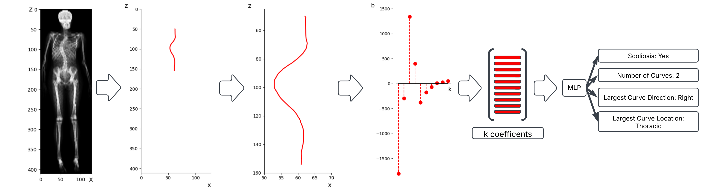
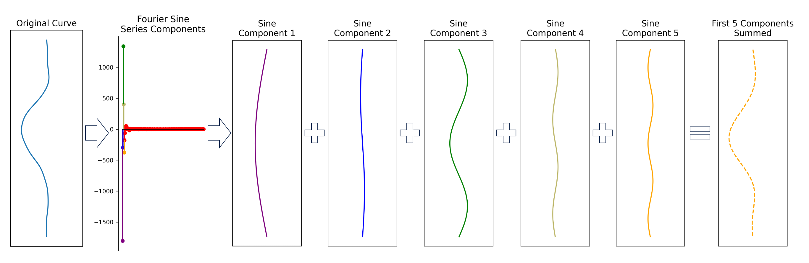
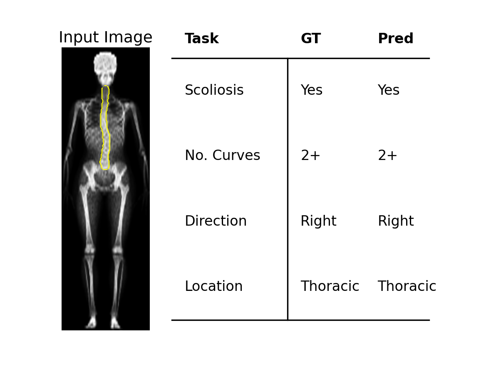
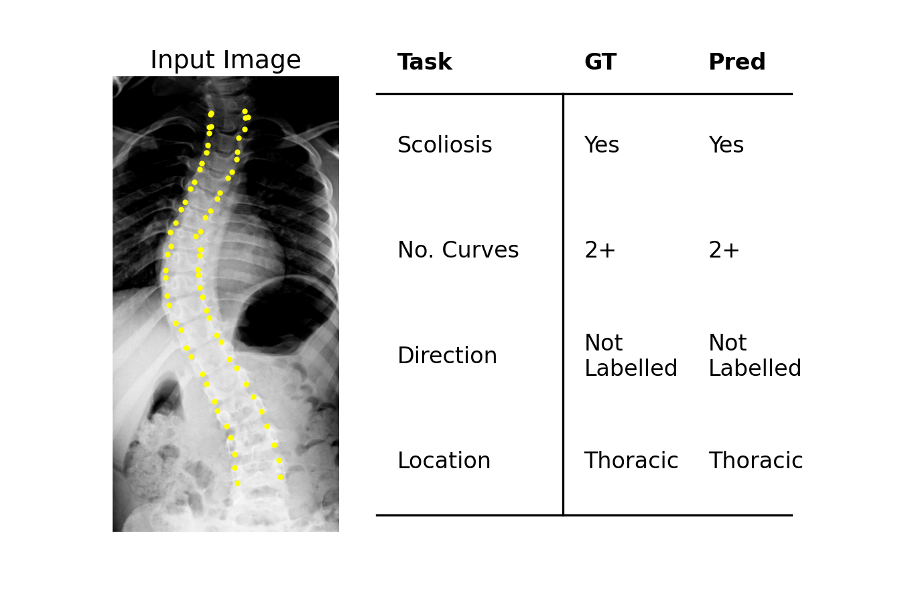
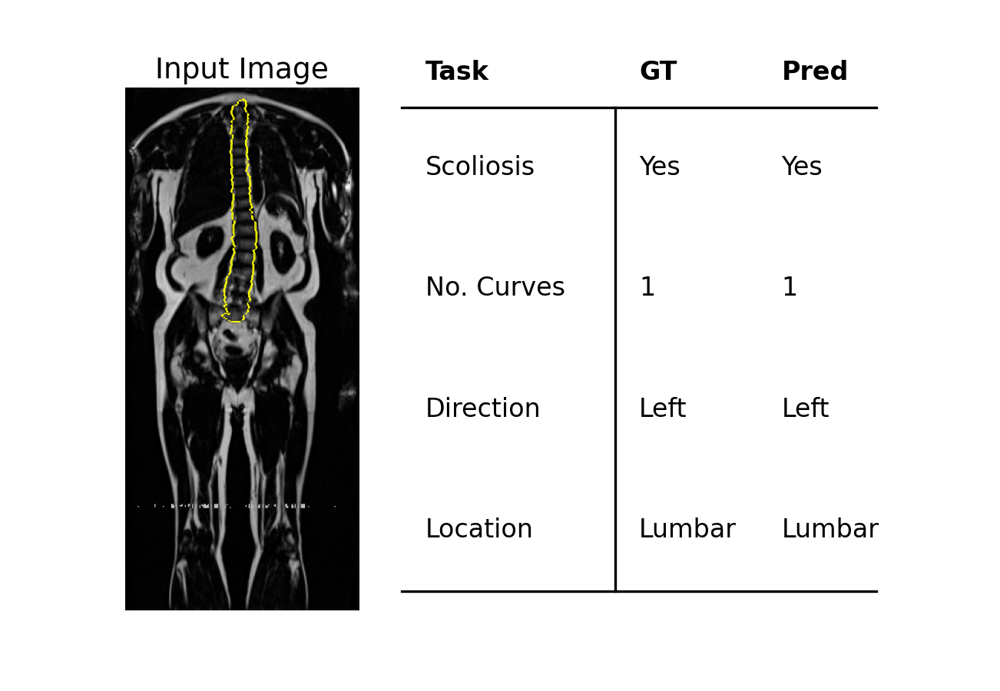

# modality-agnostic-representation
Code for the MICCAI 2025 ShapeMI workshop paper "A Modality-Agnostic Representation for Scoliosis Phenotyping"

A real-valued sine low-dimensional Fourier Sine Series is used to model the shape of the spine. This allows the spine to be modeled as a ten real-valued sine components, which are fed-into a simple neural network to classify the Phenotypic characteristics of Adolescent Idiopathic Scoliosis. The model is trained soley on DXA dervied representations but a single model can classify across DXA, X-Ray and MRI derived representations.

We use a discrete Sine Transform to decompose the sine signal into it's component parts and the Sine componenets are summed for a full or partial reconstruction.

The results of examples of our method are shown.  

  
  
  

To install the environment and run the code run the lines below.
<pre><code>conda create -n scoliosis_fourier python=3.12
conda activate scoliosis_fourier
pip install -r requirements.txt</code></pre>
